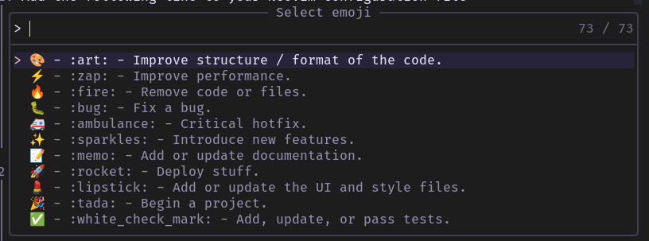

# Smoji (Select Emoji)



## Overview

The Select Emoji Plugin (Smoji) is a simple and lightweight plugin for Neovim that provides a fast and efficient way to insert emojis into your commit messages. Inspired by the popular CLI tool gitmoji, this plugin aims to improve the commit message writing experience by presenting a prompt with a curated list of emojis.

## Features

- Fast and responsive emoji prompt within Neovim.
- Curated list of emojis sourced from gitmoji for meaningful commit messages.
- Easy-to-use interface with smooth emoji selection.

## Installation

Use your preferred package manager for Neovim, such as [Lazy](https://github.com/folke/lazy.nvim), [Vundle](https://github.com/VundleVim/Vundle.vim), or [packer.nvim](https://github.com/wbthomason/packer.nvim).

For example, using Lazy:

1. Add the following lines to your Neovim configuration file

   ```lua
    "zakissimo/smoji.nvim",
    dependencies = { "stevearc/dressing.nvim" },
    cmd = "Smoji",
    keys = {
      { "<leader><leader>e", "<cmd>Smoji<cr>", desc = "Git[e]moji" },
      { "<C-e>", "<cmd>Smoji<cr>", desc = "Git[e]moji", mode = "i"},
      { "<C-e>", "<cmd>Smoji<cr>", desc = "Git[e]moji", mode = "t"},
    },
    config = function()
      require("smoji")
    end,
   ```

2. Require smoji somewhere in your configuration file (if not done yet)

    ```vim
    require("smoji")
    ```

3. Reload your Neovim configuration

## Usage

1. When you are in insert mode, use the following command to trigger the emoji prompt:

   ```vim
   :Smoji
   ```

2. The emoji prompt will pop up, displaying a list of emojis along with their meanings.

3. Navigate and select the desired emoji.

4. Press Enter to insert the selected emoji into your commit message.

## Configuration

You can customize the behavior of the Neovim Emoji Prompt Plugin by setting the following options in your Neovim configuration file.

### `Custom emoji list`

By default, the plugin uses emojis from gitmoji. If you want to use a custom list of emojis, you can set this variable to a list of emoji strings. For example:

TODO!

### `Custom prompt message`

TODO!

### `Define mappings`

If you prefer to use custom mappings instead of `:Smoji` command

```vim
vim.keymap.set("n", "<Leader><Leader>e", "<CMD>Smoji<CR>")
```

## Acknowledgments

This plugin was inspired by the [gitmoji](https://gitmoji.dev/) CLI tool, which provides a list of emojis for use in commit messages.

## Contributing

If you find any issues or have suggestions for improvement, feel free to open an issue or submit a pull request on the [GitHub repository](https://github.com/zakissimo/smoji.nvim).

---

Happy committing with emojis! 🎉😄🚀
